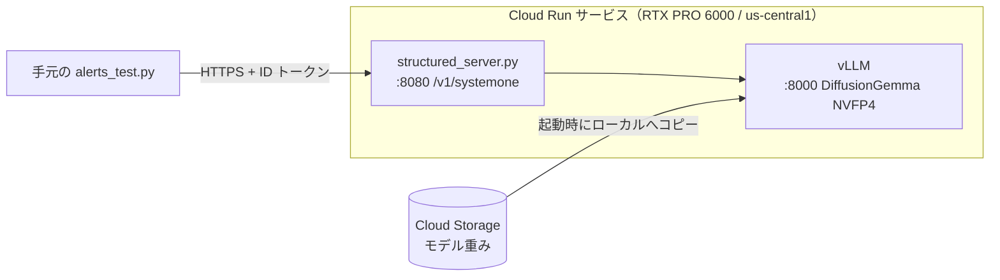

## はじめに

2026年9月15日に TypeSafe AI が公開した **Jev** は、文章を書くかわりに「判定」を返すモデルです。プログラムの状態と、あらかじめ型を決めた質問（Choice / Score / Noul）を渡すと、それぞれの答えを確率付きで1回のパスで返します。

同じことを、Google の拡散型言語モデル **DiffusionGemma** で実現する仕組みが vLLM に入りました（[vllm-project/vllm#57250](https://github.com/vllm-project/vllm/pull/57250)、通称 "DiffusionGemma as Jev"）。この記事では、それを **Cloud Run の GPU（NVIDIA RTX PRO 6000 Blackwell）** に載せ、監視アラートの一次判定をさせてみた結果をまとめます。

先に結果を書くと、8件のアラートに対する重大度・原因領域・要対応の判定（計24項目）は **すべて期待どおり** でした。レスポンスは東京の手元マシンから us-central1 を叩いて、1件あたりおおむね **300ms 前後** です。

## 背景

### Jev とは

Jev は TypeSafe AI が「System One Model」と呼ぶ判定専用のモデルです。質問の型は次の3つです。

| 型 | 返すもの | 例 |
|---|---|---|
| Choice | 選択肢ごとの確率と confidence | どのチームに回すか |
| Score | 順序付きのレベルと確率 | 深刻度はどれくらいか |
| Noul | yes の確率（0〜1） | 人間の確認が必要か |

「JSON を返して」と頼んだ LLM がトークンを1つずつ書いていくのと違い、答えの空欄をまとめて埋めるのが特徴です。

### DiffusionGemma とは

DiffusionGemma は Google DeepMind が2026年6月に公開した実験的なオープンモデルです。Gemma 4 26B A4B（MoE、アクティブ約3.8B）をベースに、トークンを左から順に生成するのではなく、256トークンのブロック（キャンバス）全体をノイズから並列に復元していきます。

### "DiffusionGemma as Jev" の仕組み

拡散モデルは1回の推論ステップでキャンバス全体の分布を出します。そこで次のようにします。

1. 回答テンプレート（例：`severity: @\ncategory: @`）をキャンバスにあらかじめ書き込む
2. 答えの位置（`@`）だけをノイズのままにする
3. **1ステップだけ** 復元させ、その位置のトークンの logprobs を読む

選択肢はサーバー側で `A`、`B`、`1`、`2` のような **1トークンのラベル** に置き換えられるので、各位置の logprobs がそのまま選択肢の確率になります。1回目の読み取りのエントロピーが閾値（既定 0.1）を超えたときだけ、ノイズを変えて最大4回まで読み直し、平均を取ります。

PR には、この処理を担うサンプルサーバー `structured_server.py` が含まれていて、Jev 互換の `POST /v1/systemone` を提供します。今回はこれをそのまま使いました。

## 構成



- **GPU**: NVIDIA RTX PRO 6000 Blackwell（VRAM 96GB）。CPU 20・メモリ 80GiB が最低条件です
- **モデル**: `nvidia/diffusiongemma-26B-A4B-it-NVFP4`。Blackwell のネイティブ FP4 で動かします
- **リージョン**: us-central1。執筆時点では東京（asia-northeast1）は Cloud Run GPU の対象外です
- **重み**: Cloud Storage のバケットをボリュームとしてマウントし、永続キャッシュにします

1つのコンテナの中で vLLM（内部ポート 8000）と structured_server（公開ポート 8080）の2プロセスを動かしています。

## 実装

### Dockerfile

PR #57250 は vLLM の main にマージ済みなので、nightly イメージをベースにし、サンプルサーバーを取り込むだけです。

```dockerfile:Dockerfile
# DiffusionGemma-as-Jev on Cloud Run (NVIDIA RTX PRO 6000 Blackwell)
# PR #57250 (structured reads) は vLLM main にマージ済みなので nightly イメージを使う
FROM vllm/vllm-openai:nightly

# Jev 互換の /v1/systemone を提供するサンプルサーバー
# 再現性が必要なら main を特定のコミット SHA に置き換える
ARG VLLM_REF=main
ADD https://raw.githubusercontent.com/vllm-project/vllm/${VLLM_REF}/examples/features/structured_diffusion/structured_server.py /app/structured_server.py

COPY start.sh /app/start.sh
RUN chmod +x /app/start.sh

# モデル重みは Cloud Storage ボリューム (/models) に置く
ENV MODEL_REPO=nvidia/diffusiongemma-26B-A4B-it-NVFP4 \
    MODEL_DIR=/models/diffusiongemma-26B-A4B-it-NVFP4 \
    CANVAS=64 \
    VLLM_USE_FLASHINFER_MOE_FP4=0 \
    HF_HUB_ENABLE_HF_TRANSFER=0

ENTRYPOINT ["/app/start.sh"]
```

### start.sh

起動スクリプトのポイントは、**重みを Cloud Storage FUSE から直接読ませない** ことです（理由は後述の「ハマったところ」に書きました）。

```bash:start.sh
#!/usr/bin/env bash
# 重みをローカル（インメモリ）にコピーしてから vLLM (127.0.0.1:8000) を起動し、
# 準備ができたら structured_server を $PORT で公開する
set -euo pipefail

PORT="${PORT:-8080}"
GCS_DIR="${MODEL_DIR}"                       # Cloud Storage FUSE マウント（永続キャッシュ）
LOCAL_DIR="${LOCAL_MODEL_DIR:-/tmp/model}"   # コンテナ内ローカル（インメモリ、メモリ上限に計上）

ts() { date +%H:%M:%S; }
mkdir -p "${LOCAL_DIR}"

if [ -f "${GCS_DIR}/config.json" ]; then
  # 2回目以降: バケットから順次読み出しでローカルへコピー
  # （FUSE 越しに safetensors を直接 mmap するとランダムアクセスになり極端に遅い）
  echo "[$(ts)] copying weights from ${GCS_DIR} -> ${LOCAL_DIR}"
  ( cd "${GCS_DIR}" && find . -type f -print0 \
      | xargs -0 -P 8 -I{} sh -c 'mkdir -p "'"${LOCAL_DIR}"'/$(dirname "{}")" && cp "{}" "'"${LOCAL_DIR}"'/{}"' )
else
  # 初回: Hugging Face からローカルへ直接ダウンロードし、バケットへは裏で保存
  echo "[$(ts)] downloading ${MODEL_REPO} -> ${LOCAL_DIR}"
  hf download "${MODEL_REPO}" --local-dir "${LOCAL_DIR}"
  rm -rf -- "${LOCAL_DIR:?}/.cache"
  ( mkdir -p "${GCS_DIR}" \
    && cp -r "${LOCAL_DIR}/." "${GCS_DIR}/" \
    && echo "[$(ts)] weights saved to bucket" ) &
fi
echo "[$(ts)] weights ready: $(du -sh "${LOCAL_DIR}" | cut -f1)"

# vLLM を内部ポートで起動
vllm serve "${LOCAL_DIR}" \
  --served-model-name dgemma \
  --host 127.0.0.1 --port 8000 \
  --diffusion-config "{\"canvas_length\": ${CANVAS}}" \
  --max-logprobs 32 \
  --enable-prefix-caching \
  --async-scheduling \
  --max-num-seqs 32 \
  --max-model-len 8192 \
  --gpu-memory-utilization 0.90 &
VLLM_PID=$!

echo "[$(ts)] waiting for vLLM..."
until curl -sf http://127.0.0.1:8000/health > /dev/null; do
  if ! kill -0 "${VLLM_PID}" 2>/dev/null; then
    echo "[$(ts)] vLLM exited during startup" >&2
    exit 1
  fi
  sleep 5
done
echo "[$(ts)] vLLM is ready"

# Jev 互換サーバーを公開ポートで起動
exec python3 /app/structured_server.py \
  --upstream http://127.0.0.1:8000 \
  --model dgemma \
  --tokenizer "${LOCAL_DIR}" \
  --canvas "${CANVAS}" \
  --host 0.0.0.0 --port "${PORT}"
```

## デプロイ手順

実験用に新しいプロジェクトを作るところから始めます。

### 1. プロジェクトの作成と API の有効化

```bash
export PROJECT_ID=dgemma-jev-20261004    # 一意な名前にする
export REGION=us-central1
export REPO=dgemma
export BUCKET=${PROJECT_ID}-models
export IMAGE=${REGION}-docker.pkg.dev/${PROJECT_ID}/${REPO}/dgemma-jev:latest

gcloud projects create ${PROJECT_ID} --name="DiffusionGemma Jev"
gcloud config set project ${PROJECT_ID}

gcloud billing accounts list
export BILLING_ACCOUNT=XXXXXX-XXXXXX-XXXXXX
gcloud billing projects link ${PROJECT_ID} --billing-account=${BILLING_ACCOUNT}

gcloud services enable \
  run.googleapis.com \
  artifactregistry.googleapis.com \
  cloudbuild.googleapis.com \
  storage.googleapis.com \
  iam.googleapis.com \
  billingbudgets.googleapis.com
```

### 2. 予算アラート

GPU を使うので、消し忘れ対策に予算アラートを入れておきます。予算の通貨は請求先アカウントの通貨に合わせます。

```bash
gcloud billing budgets create \
  --billing-account=${BILLING_ACCOUNT} \
  --display-name="dgemma-jev experiment" \
  --budget-amount=5000JPY \
  --filter-projects=projects/${PROJECT_ID} \
  --threshold-rule=percent=0.5 \
  --threshold-rule=percent=1.0
```

### 3. 権限・リポジトリ・バケット

新しいプロジェクトでは Cloud Build が Compute Engine のデフォルトサービスアカウントで動くので、ビルド用のロールを付けておきます。

```bash
export PROJECT_NUMBER=$(gcloud projects describe ${PROJECT_ID} --format='value(projectNumber)')
gcloud projects add-iam-policy-binding ${PROJECT_ID} \
  --member=serviceAccount:${PROJECT_NUMBER}-compute@developer.gserviceaccount.com \
  --role=roles/cloudbuild.builds.builder

gcloud artifacts repositories create ${REPO} \
  --repository-format=docker --location=${REGION}
gcloud storage buckets create gs://${BUCKET} --location=${REGION}

# 実行用サービスアカウント（初回起動で重みをバケットに書き込む）
gcloud iam service-accounts create dgemma-run
gcloud storage buckets add-iam-policy-binding gs://${BUCKET} \
  --member=serviceAccount:dgemma-run@${PROJECT_ID}.iam.gserviceaccount.com \
  --role=roles/storage.objectAdmin
```

### 4. ビルドとデプロイ

```bash
gcloud builds submit --tag ${IMAGE} \
  --region=${REGION} --machine-type=e2-highcpu-8 --timeout=3600

gcloud run deploy dgemma-jev \
  --image ${IMAGE} \
  --region ${REGION} \
  --service-account dgemma-run@${PROJECT_ID}.iam.gserviceaccount.com \
  --gpu 1 --gpu-type nvidia-rtx-pro-6000 --no-gpu-zonal-redundancy \
  --cpu 20 --memory 80Gi \
  --no-cpu-throttling \
  --concurrency 8 \
  --min-instances 0 --max-instances 1 \
  --timeout 600 \
  --execution-environment gen2 \
  --add-volume name=models,type=cloud-storage,bucket=${BUCKET} \
  --add-volume-mount volume=models,mount-path=/models \
  --startup-probe httpGet.path=/health,httpGet.port=8080,periodSeconds=10,failureThreshold=180,timeoutSeconds=5 \
  --no-allow-unauthenticated
```

起動プローブは structured_server の `/health` を見ます。structured_server は vLLM の準備が終わってから起動するので、重みのコピー・読み込み・torch.compile・CUDA graph の作成が終わるまで、トラフィックは流れてきません。

## アラート分類を試す

### 質問スキーマ

アラート1件ごとに、次の4つの質問を1リクエストで投げます。

```python
QUESTIONS = {
    "severity": {
        "type": "score",
        "instructions": "このアラートの深刻度はどれか。",
        "criteria": ["info", "warning", "error", "critical"],
    },
    "category": {
        "type": "choice",
        "instructions": "このアラートの原因領域として最も近いものはどれか。",
        "criteria": {
            "infra": "コンピュート、コンテナ、ディスク、メモリなどの基盤リソース",
            "app": "アプリケーションのエラー、例外、レイテンシ",
            "database": "DB の接続、レプリケーション、スロークエリ",
            "network": "DNS、ロードバランサ、証明書、疎通",
            "security": "不審なアクセス、認証失敗、脆弱性",
            "cost": "課金、予算、利用量の急増",
        },
    },
    "actionable": {
        "type": "noul",
        "instructions": "今すぐ人間の対応が必要か。",
        "criteria": {
            "true": "放置するとユーザー影響やデータ損失が起きる",
            "false": "自動回復する、または情報提供のみ",
        },
    },
    "page_oncall": {
        "type": "noul",
        "instructions": "深夜でもオンコール担当者を呼び出すべきか。",
        # actionable が yes のときだけ聞く（no なら null が返る）
        "ask_if": {"actionable": ["yes"]},
    },
}
```

`page_oncall` には `ask_if` を付けました。`actionable` の答えが yes のときだけ、その答えを踏まえて後段で聞きます。条件付きの質問をスキーマだけで書けるのは便利です。

リクエストは次の形です。`state` には、アラートの JSON をそのまま入れます。

```bash
curl -s ${SERVICE_URL}/v1/systemone \
  -H "Authorization: Bearer $(gcloud auth print-identity-token)" \
  -H 'content-type: application/json' \
  -d '{"model":"jev-latest",
       "instructions":"あなたは SRE チームのアラート一次判定を担当しています。",
       "state":{"source":"CloudWatch","title":"RDS prod-db ReplicaLag > 300s"},
       "questions":{ ...上の QUESTIONS... },
       "samples":"auto"}'
```

テストスクリプトの全体は次のとおりです。

:::details alerts_test.py
```python:alerts_test.py
#!/usr/bin/env python3
"""Cloud Run 上の DiffusionGemma-as-Jev でアラートを分類する動作確認スクリプト。

使い方:
  export SERVICE_URL=$(gcloud run services describe dgemma-jev \
      --region us-central1 --format 'value(status.url)')
  python3 alerts_test.py
"""

import json
import os
import ssl
import subprocess
import time
import urllib.request

# macOS の python.org 版 Python などは OS の証明書ストアを使わず、
# CERTIFICATE_VERIFY_FAILED になることがある。certifi があればその CA バンドルを使う。
# （SSL_CERT_FILE が設定されていればそちらを優先）
try:
    import certifi

    SSL_CTX = ssl.create_default_context(
        cafile=os.environ.get("SSL_CERT_FILE") or certifi.where()
    )
except ImportError:
    SSL_CTX = ssl.create_default_context()

SERVICE_URL = os.environ["SERVICE_URL"].rstrip("/")
TOKEN = subprocess.check_output(
    ["gcloud", "auth", "print-identity-token"], text=True
).strip()

# ---- 質問スキーマ（Jev の Choice / Score / Noul） ----------------------------
QUESTIONS = {
    "severity": {
        "type": "score",
        "instructions": "このアラートの深刻度はどれか。",
        "criteria": ["info", "warning", "error", "critical"],
    },
    "category": {
        "type": "choice",
        "instructions": "このアラートの原因領域として最も近いものはどれか。",
        "criteria": {
            "infra": "コンピュート、コンテナ、ディスク、メモリなどの基盤リソース",
            "app": "アプリケーションのエラー、例外、レイテンシ",
            "database": "DB の接続、レプリケーション、スロークエリ",
            "network": "DNS、ロードバランサ、証明書、疎通",
            "security": "不審なアクセス、認証失敗、脆弱性",
            "cost": "課金、予算、利用量の急増",
        },
    },
    "actionable": {
        "type": "noul",
        "instructions": "今すぐ人間の対応が必要か。",
        "criteria": {
            "true": "放置するとユーザー影響やデータ損失が起きる",
            "false": "自動回復する、または情報提供のみ",
        },
    },
    "page_oncall": {
        "type": "noul",
        "instructions": "深夜でもオンコール担当者を呼び出すべきか。",
        # actionable が yes のときだけ聞く（no なら null が返る）
        "ask_if": {"actionable": ["yes"]},
    },
}

# ---- テスト用アラートと期待値 -------------------------------------------------
ALERTS = [
    {
        "alert": {
            "source": "Cloud Monitoring",
            "title": "Cloud Run service api-prod: 5xx ratio > 20% for 10 min",
            "service": "api-prod",
        },
        "want": {"severity": "critical", "category": "app", "actionable": "yes"},
    },
    {
        "alert": {
            "source": "CloudWatch",
            "title": "RDS prod-db ReplicaLag > 300s",
            "detail": "Read replica is falling behind the primary.",
        },
        "want": {"severity": "error", "category": "database", "actionable": "yes"},
    },
    {
        "alert": {
            "source": "cert-monitor",
            "title": "TLS certificate for www.example.com expires in 25 days",
        },
        "want": {"severity": "warning", "category": "network", "actionable": "no"},
    },
    {
        "alert": {
            "source": "Billing",
            "title": "予算アラート: 今月の利用額が予算の 90% に到達しました",
        },
        "want": {"severity": "warning", "category": "cost", "actionable": "no"},
    },
    {
        "alert": {
            "source": "ECS",
            "title": "Task stopped: OutOfMemoryError (exit code 137)",
            "detail": "Service rails-backend replaced the task automatically. 1 occurrence.",
        },
        "want": {"severity": "warning", "category": "infra", "actionable": "no"},
    },
    {
        "alert": {
            "source": "IAM audit",
            "title": "Root account login from unrecognized IP 203.0.113.7",
            "detail": "MFA not used. Country: unknown.",
        },
        "want": {"severity": "critical", "category": "security", "actionable": "yes"},
    },
    {
        "alert": {
            "source": "Cloud Monitoring",
            "title": "Disk usage on batch-worker-3 at 95%",
            "detail": "Growing about 2% per hour.",
        },
        "want": {"severity": "error", "category": "infra", "actionable": "yes"},
    },
    {
        "alert": {
            "source": "Deploy bot",
            "title": "Deployment frontend v2.14.0 completed successfully",
        },
        "want": {"severity": "info", "category": "app", "actionable": "no"},
    },
]


def systemone(state):
    body = {
        "model": "jev-latest",
        "instructions": "あなたは SRE チームのアラート一次判定を担当しています。",
        "state": state,
        "questions": QUESTIONS,
        "samples": "auto",
    }
    req = urllib.request.Request(
        SERVICE_URL + "/v1/systemone",
        data=json.dumps(body).encode(),
        headers={
            "content-type": "application/json",
            "authorization": f"Bearer {TOKEN}",
        },
    )
    with urllib.request.urlopen(req, timeout=600, context=SSL_CTX) as r:
        return json.load(r)


def top(probs):
    k = max(probs, key=probs.get)
    return k, probs[k]


def main():
    ok = total = 0
    for case in ALERTS:
        t0 = time.time()
        res = systemone(case["alert"])
        ms = (time.time() - t0) * 1000
        a = res["answers"]

        sev_idx, sev_p = top(a["severity"]["probabilities"])
        sev = a["severity"]["legend"][sev_idx]
        cat, cat_p = a["category"]["choice"], a["category"]["confidence"]
        act_p = a["actionable"]["noul"]
        act = "yes" if act_p >= 0.5 else "no"
        page = a["page_oncall"]
        page_s = "-" if page is None else f"{page['noul']:.2f}"

        got = {"severity": sev, "category": cat, "actionable": act}
        for k, v in case["want"].items():
            total += 1
            ok += got[k] == v
        mark = "ok  " if got == case["want"] else "MISS"
        reads = res["diagnostics"]["timing"]["reads"]
        print(
            f"{mark} {case['alert']['title'][:48]:<48} "
            f"sev={sev}({sev_p:.2f}) cat={cat}({cat_p:.2f}) "
            f"act={act_p:.2f} page={page_s} reads={reads} {ms:.0f}ms"
        )
        if got != case["want"]:
            print(f"     want={case['want']}")
    print(f"\naccuracy {ok}/{total} ({ok / total:.0%})")


if __name__ == "__main__":
    main()
```
:::

### 結果

```
ok   Cloud Run service api-prod: 5xx ratio > 20% for  sev=critical(0.89) cat=app(1.00) act=1.00 page=1.00 reads=5 761ms
ok   RDS prod-db ReplicaLag > 300s                    sev=error(0.78) cat=database(0.90) act=0.67 page=0.68 reads=8 338ms
ok   TLS certificate for www.example.com expires in 2 sev=warning(0.99) cat=network(1.00) act=0.01 page=- reads=1 230ms
ok   予算アラート: 今月の利用額が予算の 90% に到達しました                   sev=warning(0.94) cat=cost(1.00) act=0.03 page=- reads=4 288ms
ok   Task stopped: OutOfMemoryError (exit code 137)   sev=warning(0.85) cat=infra(0.92) act=0.01 page=- reads=4 321ms
ok   Root account login from unrecognized IP 203.0.11 sev=critical(0.80) cat=security(0.98) act=0.99 page=1.00 reads=5 311ms
ok   Disk usage on batch-worker-3 at 95%              sev=error(0.54) cat=infra(0.98) act=0.73 page=0.00 reads=5 307ms
ok   Deployment frontend v2.14.0 completed successful sev=info(1.00) cat=app(0.67) act=0.00 page=- reads=4 308ms

accuracy 24/24 (100%)
```

| アラート | 深刻度 | 原因領域 | 要対応 | 呼び出し | 時間 |
|---|---|---|---|---|---|
| api-prod 5xx 率 20% 超 | critical (0.89) | app (1.00) | 1.00 | 1.00 | 761ms |
| RDS レプリカ遅延 300秒超 | error (0.78) | database (0.90) | 0.67 | 0.68 | 338ms |
| TLS 証明書 期限25日前 | warning (0.99) | network (1.00) | 0.01 | – | 230ms |
| 予算の 90% に到達 | warning (0.94) | cost (1.00) | 0.03 | – | 288ms |
| ECS タスク OOM（自動置換済み） | warning (0.85) | infra (0.92) | 0.01 | – | 321ms |
| root ログイン（未知の IP、MFA なし） | critical (0.80) | security (0.98) | 0.99 | 1.00 | 311ms |
| ディスク使用率 95% | error (0.54) | infra (0.98) | 0.73 | 0.00 | 307ms |
| デプロイ成功の通知 | info (1.00) | app (0.67) | 0.00 | – | 308ms |

括弧内は、選ばれたラベルの確率です。「要対応」と「呼び出し」は yes の確率で、「–」は `ask_if` によって質問自体がスキップされたことを表します。

### 結果から読み取れること

**確信度が実際の迷い具合を表している**

正解・不正解だけでなく、確率の値が判断の難しさをよく反映していました。

- TLS 証明書の期限切れ予告や予算アラートは、深刻度も要対応も0.9以上で迷いがありません
- RDS のレプリカ遅延は、要対応が 0.67、呼び出しが 0.68 と中間的です。「今すぐユーザー影響が出るわけではないが放置はまずい」という、人間でも判断が分かれるところです
- ディスク使用率 95% は、深刻度 error が 0.54 しかありません。要対応は 0.73 なのに、深夜の呼び出しは 0.00 でした。「対応は要るが朝まで待てる」という判断で、個人的にも納得感があります

本番に組み込むなら、「確率が 0.9 以上なら自動で振り分け、それ未満なら人間のキューに回す」といった閾値のルーティングがそのまま書けます。

**`reads` の数で迷い方がわかる**

`reads` は読み取りの回数です。今回のスキーマは `ask_if` があるので2段階で読まれ、その合計が表示されています。

| reads | 内訳 |
|---|---|
| 1 | 1段目が1回で確定し、`page_oncall` はスキップ |
| 4 | 1段目で迷って4回読み直し、`page_oncall` はスキップ |
| 5 | 1段目が4回、`page_oncall` が1回 |
| 8 | 1段目も `page_oncall` も4回ずつ |

1回で確定したのは TLS 証明書だけでした。4つの質問のうちどれか1つでもエントロピーが閾値を超えると読み直しになるので、質問が多いほど読み直しが起きやすくなります。

**レイテンシ**

測った時間は、東京の手元から us-central1 までの往復を含むクライアント側の値です。読み直しを含めても、1件おおむね 230〜340ms でした。最初の1件だけ 761ms かかっていますが、プレフィックスキャッシュ（同じシステムプロンプトの部分）がまだ温まっていなかったためだと思われます。読み直しは並列に投げられるので、reads=8 でも時間はほとんど増えていません。

## ハマったところ

### 1. 重みの読み込みが遅く、デプロイがタイムアウトした

最初は、Cloud Storage FUSE でマウントしたバケットから vLLM に直接重みを読ませていました。すると、ログが次のような状態で止まり、`gcloud run deploy` がタイムアウトしました。

```
Loading safetensors checkpoint shards:  50% Completed | 1/2 [10:57<10:57, 657.67s/it]
```

シャード1つに約11分かかっています。メモリ不足を疑いましたが、そうであれば「Memory limit exceeded」でコンテナが落ちるはずで、実際は遅いながらも進んでいました。

原因は、vLLM が safetensors をメモリマップして **飛び飛びに読む** ことです。Cloud Storage FUSE は先頭から順に読むのは得意ですが、ランダムアクセスは非常に苦手です。

そこで start.sh で、バケットからコンテナ内の `/tmp/model` へ **8並列で順次コピーしてから** vLLM に読ませるようにしました。これで起動が現実的な時間に収まりました。Cloud Run のコンテナ内ファイルシステムはメモリ上にあるので、コピーした重み（約18GB）はメモリ上限に計上されます。それでも 80GiB の範囲に収まりました。

Cloud Run の GPU ベストプラクティスでも、大きなモデルは起動時に Cloud Storage からダウンロードする方法が最速とされています。

### 2. 手元の Python で CERTIFICATE_VERIFY_FAILED

テストスクリプトを実行すると、次のエラーが出ました。

```
urllib.error.URLError: <urlopen error [SSL: CERTIFICATE_VERIFY_FAILED] certificate verify failed: unable to get local issuer certificate (_ssl.c:1032)>
```

macOS の python.org 版 Python は OS の証明書ストアを使わないため、CA 証明書が見つからないことがあります。`pip install certifi` をしたうえで、スクリプト側で `ssl.create_default_context(cafile=certifi.where())` を使うようにして解決しました。

### 3. 東京リージョンでは GPU が使えない

Cloud Run の GPU は、RTX PRO 6000・L4 ともに東京リージョンに対応していません（執筆時点）。今回は us-central1 を使いました。

## 費用

Cloud Run の GPU はインスタンス単位の課金で、GPU・CPU・メモリが起動中ずっと課金されます。今回の構成の単価は次のとおりです。

| 項目 | 単価 | 1時間あたり |
|---|---|---|
| RTX PRO 6000（ゾーン冗長なし） | $0.00036522/秒 | 約 $1.31 |
| CPU 20 vCPU | $0.000018/vCPU秒 | 約 $1.30 |
| メモリ 80GiB | $0.000002/GiB秒 | 約 $0.58 |
| **合計** | | **約 $3.2/時** |

`--min-instances 0` にしておけば、使わない間はゼロまでスケールダウンして課金が止まります。ただし、最後のリクエストのあと停止するまでのアイドル時間にも課金されます。常時起動にすると、月 $2,300 前後かかる計算です。

実験が終わったら、プロジェクトごと消すのが確実です。

```bash
gcloud projects delete ${PROJECT_ID}
```

## 注意点

- **評価としての限界**: 今回は8件・24項目で、期待値も自分で付けたものです。精度のベンチマークではなく、動作確認として見てください。PR のコメントでは、1万件超の構造化リクエストでの評価も報告されています。スキーマの切り方で精度が大きく変わるという指摘もあります
- **再現性**: 同じリクエストを繰り返しても、約2.4%で判定が入れ替わったという報告が PR のコメントにあります。ガードレール用途では、`samples` や閾値の調整を検討したほうがよさそうです
- **バージョン**: vLLM の nightly イメージとサンプルサーバーの main を使っています。動いた時点のタグやコミットに固定しておくのがおすすめです
- **プロンプトインジェクション**: Jev と同様、`state` に入れた文字列の指示に判定が引っ張られる可能性があります。外部から来るテキストを判定に使う場合は、敵対的な入力でもテストしておくべきです

## まとめ

- DiffusionGemma の「キャンバスを事前に埋めて、空欄だけ1ステップで復元する」という使い方で、Jev のような判定 API を自前で立てられました
- Cloud Run の GPU（RTX PRO 6000）でも動きます。重みは FUSE から直接読ませず、ローカルにコピーしてから読み込むのが重要でした
- アラートの一次判定では、ラベルが正しいだけでなく確率が迷い具合をよく表していたので、閾値によるルーティングに使いやすいと感じました

判定を返すだけのモデルを、自分の GPU で300ms前後で動かせるのは面白いです。次は自分の実際のアラート履歴で精度を測ってみたいと思います。

## 参考

- [vllm-project/vllm#57250: structured generation mode for DiffusionGemma model (Jev-like)](https://github.com/vllm-project/vllm/pull/57250)
- [vLLM: Structured reads on DiffusionGemma（examples/features/structured_diffusion）](https://github.com/vllm-project/vllm/tree/main/examples/features/structured_diffusion)
- [DiffusionGemma: 4x faster text generation（Google Blog）](https://blog.google/innovation-and-ai/technology/developers-tools/diffusion-gemma-faster-text-generation/)
- [Jev: A New Kind of AI Model Built for Decisions, Not Conversation（Eden AI）](https://www.edenai.co/post/jev-a-new-kind-of-ai-model-built-for-decisions-not-conversation)
- [GPU support for services | Cloud Run](https://docs.cloud.google.com/run/docs/configuring/services/gpu)
- [Best practices: Cloud Run services with GPUs](https://docs.cloud.google.com/run/docs/configuring/services/gpu-best-practices)
- [Cloud Run pricing](https://cloud.google.com/run/pricing)
